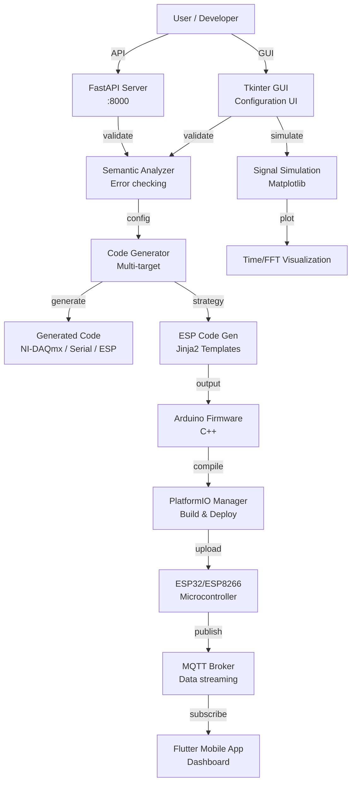

# Adaptive Semantic Code Generation for Data Acquisition Systems

A Master's thesis project implementing an intelligent software environment for automatic code generation and semantic validation of data acquisition (DAQ) systems, with support for embedded microcontrollers (ESP32/ESP8266), multiple communication protocols (MQTT, Serial), and multi-target code generation.

## Research Context

This repository represents research conducted at the graduate level, focusing on:

- **Automatic code generation** for data acquisition workflows
- **Semantic analysis and validation** of sensor configurations
- **Multi-target code generation** for diverse hardware platforms
- **Adaptive intelligent automation** to reduce manual programming burden
- **IoT/embedded system support** with practical sensor and microcontroller integration

The primary research objective is to demonstrate that intelligent code generation can significantly reduce development time and complexity for data acquisition applications while maintaining correctness and compatibility through semantic validation.

## Problem Statement

Data acquisition system development typically requires:

1. **Manual hardware configuration** - developers must understand device capabilities, pin layouts, and communication protocols
2. **Repetitive code writing** - similar boilerplate code is written repeatedly for different sensors and platforms
3. **Configuration errors** - manual setup leads to mistakes (pin conflicts, incompatible sensors, missing libraries)
4. **Portability challenges** - transitioning between platforms (NI-DAQmx, microcontrollers, serial devices) requires rewriting code
5. **Integration complexity** - coordinating multiple sensors, communication protocols, and data handlers is error-prone

This thesis addresses these challenges through **adaptive semantic code generation**.

## Objectives

1. Design and implement a semantic analysis framework for DAQ configurations
2. Create a multi-target code generation engine that produces correct, working code for different hardware platforms
3. Validate semantic correctness (pin conflicts, capability matching, protocol compatibility)
4. Build an interactive UI for configuration, simulation, and code generation
5. Support IoT workflows with MQTT and microcontroller targets
6. Demonstrate significant reduction in manual programming effort

## Key Features

### 1. Interactive GUI Configuration
- Tkinter-based desktop application for device and sensor selection
- Live visualization of signal simulation (time-domain and FFT)
- Real-time configuration preview and validation
- JSON-based configuration persistence

### 2. Semantic Analysis & Validation
- **Pin conflict detection** - identifies pins used by multiple sensors
- **Capability matching** - validates that sensors are connected to compatible pins (e.g., ADC sensors to ADC-capable pins)
- **Protocol validation** - checks MQTT credentials and WiFi settings when connectivity is enabled
- **Board compatibility** - ensures selected sensors support the target microcontroller

### 3. Multi-Target Code Generation
- **NI-DAQmx** (C/C++) for professional data acquisition hardware
- **Serial/COM** (Python) for USB-based devices
- **ESP32/ESP8266** (Arduino C++) for embedded IoT systems with MQTT support
- **Tiny RTOS** (experimental) for resource-constrained microcontrollers

### 4. Sensor & Platform Catalogs
- Extensible **sensor catalog** with metadata (pin requirements, sampling rates, communication protocols)
- **Board catalog** with hardware specifications (available pins, ADC capabilities, supported features)
- **Template-based code generation** using Jinja2 for flexible, maintainable code output

### 5. IoT & Embedded Support
- MQTT publisher for sensor data streaming
- WiFi connectivity configuration for ESP32/ESP8266
- Multiple sensor types: DHT22, BMP280, MQ135, DS18B20, and more
- Async job queues for long-running operations

### 6. Flutter Mobile Dashboard
- Cross-platform mobile app for sensor monitoring
- Real-time data visualization
- Configuration management interface
- Support for iOS and Android

### 7. REST API Server
- FastAPI backend for programmatic code generation
- Runs in server mode alongside the GUI
- Health checks and validation endpoints
- Integration with PlatformIO for firmware compilation

## System Architecture



## Project Structure

```text
masterdissertation/
├── README.md                      # This file
├── requirements.txt               # Python dependencies
├── pyproject.toml                 # Python project config
│
├── Core Components
├── daq_config.py                 # Sensor & board catalog, config model
├── semantic_analyzer.py          # Semantic validation logic
├── code_generator.py             # Multi-target code generation
├── esp_mqtt_generator.py         # ESP32/ESP8266 code generation (Strategy pattern)
├── pio_manager.py                # PlatformIO integration for firmware compilation
├── device_inspector.py           # Hardware device discovery
├── build_backend.py              # Backend build utilities
│
├── User Interfaces
├── gui.py                        # Tkinter GUI application (main UI)
├── main.py                       # CLI entry point
├── main_api.py                   # FastAPI server entry point
├── server_entry.py               # Server startup script
│
├── Deployment & Packaging
├── package_app.py                # PyInstaller packaging script
├── daq_system_installer.iss      # Inno Setup installer script
├── finish.iss                    # Installer completion script
│
├── Mobile Application
├── flutter_ui/                   # Flutter dashboard app
│   ├── pubspec.yaml
│   ├── lib/                      # Dart source code
│   ├── android/
│   └── ios/
│
├── Data & Templates
├── src/                          # Extended modules
│   └── semantic_analyzer.py      # Advanced semantic analysis
├── templates/                    # Jinja2 code templates for ESP
├── DAQ_System_Final/             # Final implementation reference
│
├── Development & Testing
├── tests/                        # Unit and integration tests
├── .idea/                        # IDE configuration
└── {userdesktop}/                # Build/installer output
```

## Technology Stack

| Component | Technology | Purpose |
|---|---|---|
| **GUI** | Python, Tkinter, Matplotlib | Interactive configuration and visualization |
| **Backend API** | Python, FastAPI, Pydantic | Server-based code generation |
| **Core Logic** | Python 3.12+ | Semantic analysis, code generation |
| **Code Generation** | Jinja2 templates, Python | Template-based multi-target code output |
| **Embedded** | Arduino C++, MicroPython (optional) | Generated firmware for ESP32/ESP8266 |
| **Firmware Build** | PlatformIO | Cross-platform embedded compilation |
| **MQTT** | paho-mqtt | IoT data streaming |
| **Hardware Support** | pyserial, nidaqmx | Device communication |
| **Mobile** | Flutter (Dart) | Cross-platform dashboard |
| **Testing** | pytest, ruff, black | Code quality and validation |
| **Packaging** | PyInstaller, Inno Setup | Standalone Windows executables |

## Core Components Explained

### 1. DAQ Configuration Model (`daq_config.py`)

Defines:
- **SENSOR_CATALOG** - metadata for each supported sensor (DHT22, BMP280, MQ135, DS18B20, etc.)
- **BOARD_CATALOG** - specifications for microcontrollers (ESP32, ESP8266)
- **DAQConfig** - dataclass representing the complete configuration

Example sensor entry:
```python
"DHT22": {
    "protocol": "1-Wire",
    "sampling_rate_hz": 0.5,
    "default_pin": 4,
    "requires_pin": True,
    "pin_capability": "GPIO",
    "mcu_support": ["ESP32", "ESP8266"],
    "mqtt_topic": "sensors/temperature_humidity",
    "templates": {
        "ESP32": "templates/dht22_esp32.jinja2",
        "ESP8266": "templates/dht22_esp8266.jinja2"
    }
}
```

### 2. Semantic Analysis (`semantic_analyzer.py`)

Validates DAQ configurations for:
- **Pin conflicts** - ensures no pin is used by multiple sensors
- **Hardware compatibility** - checks if analog sensors are connected to ADC-capable pins
- **Protocol requirements** - validates MQTT broker/WiFi when enabled
- **Board support** - verifies sensor is compatible with selected MCU

Returns list of errors/warnings for user feedback.

### 3. Code Generation (`code_generator.py` & `esp_mqtt_generator.py`)

**Strategy Pattern** implementation:
- Each sensor has a **Jinja2 template** for code generation
- Registry of strategies for each (sensor, board) pair
- Renders C++ code for the selected platform
- Outputs ready-to-compile firmware

**Supported targets:**
- `generate_nidaqmx_code()` - NI hardware acquisition code
- `generate_serial_code()` - USB/serial communication code
- `esp_mqtt_generator.generate_code()` - ESP32/ESP8266 with MQTT
- `generate_tiny_rtos_code()` - Minimal embedded RTOS code

### 4. GUI Application (`gui.py`)

**Tkinter desktop application** with:
- Device/sensor selection dropdowns
- Pin configuration inputs
- MQTT and WiFi credential fields
- Live signal simulation with FFT analysis
- JSON configuration save/load
- Code generation and export buttons

### 5. PlatformIO Manager (`pio_manager.py`)

Integrates with **PlatformIO CLI** to:
- Create project structures
- Install dependencies
- Compile firmware
- Upload to ESP32/ESP8266
- Manage build outputs

### 6. REST API (`main_api.py`)

**FastAPI server** providing:
```
POST /generate
  - Input: DAQ configuration (JSON)
  - Output: Generated code (C++/Python)
  - Includes semantic validation

GET /sensors
  - Lists available sensors with metadata

GET /boards
  - Lists supported microcontrollers

POST /validate
  - Validates configuration for errors
```

## Workflow & Process

### Interactive Configuration Workflow

```
1. Launch GUI (python gui.py)
   ↓
2. Select target platform (ESP32 / NI-DAQmx / Serial)
   ↓
3. Scan for available devices
   ↓
4. Select sensors to acquire data from
   ↓
5. Configure pins, sample rates, MQTT settings
   ↓
6. Semantic analyzer validates configuration
   ↓
7. (Optional) Run simulation to preview behavior
   ↓
8. Generate code for target platform
   ↓
9. Export code or compile + upload
   ↓
10. Start acquisition (data flows to MQTT / API)
```

### Semantic Analysis Workflow

```
User Configuration
  ↓
Semantic Analyzer
  ├─ Check pin conflicts
  ├─ Validate hardware compatibility
  ├─ Check protocol requirements
  └─ Return errors/warnings
  ↓
[If valid]
  → Code Generation
[If invalid]
  → Display errors to user
  → User corrects configuration
  → Re-validate
```

### Code Generation Workflow

```
Validated Configuration
  ↓
Code Generator
  ├─ For each sensor:
  │  ├─ Look up Jinja2 template
  │  ├─ Render with sensor config
  │  └─ Collect code fragment
  └─ Merge fragments into complete program
  ↓
Generated Firmware (C++ / Python / etc.)
  ↓
[For ESP]
  → PlatformIO compile
  → Upload to device
  → Start MQTT publishing
```

## Installation

### Prerequisites

- Python 3.11+ (3.12 recommended for optimal compatibility)
- Virtual environment (venv or conda)
- (Optional) PlatformIO CLI for embedded compilation
- (Optional) Docker for containerized deployment

### Setup

```bash
# Clone repository
git clone https://github.com/Saidmurotov/masterdissertation.git
cd masterdissertation

# Create virtual environment
python -m venv venv
source venv/bin/activate   # On Windows: venv\Scripts\activate

# Install dependencies
pip install -r requirements.txt

# (Optional) Install PlatformIO for ESP compilation
pip install platformio
pio platform install espressif32
```

## Configuration

### Environment Variables (Optional)

```bash
# For MQTT integration
MQTT_BROKER=localhost
MQTT_PORT=1883
MQTT_TOPIC=daq/esp32_01/sensors

# For API server
API_PORT=8000
API_HOST=0.0.0.0

# For hardware paths (if using serial)
SERIAL_PORT=/dev/ttyUSB0  # Linux/macOS
# or COM3                   # Windows
BAUD_RATE=115200
```

### Sensor Configuration File

JSON format for pre-configured setups:
```json
{
  "board": "ESP32",
  "mqtt_enabled": true,
  "wifi_ssid": "your_network",
  "wifi_password": "your_password",
  "mqtt_broker": "192.168.1.100",
  "mqtt_port": 1883,
  "sensors": [
    {
      "type": "DHT22",
      "pin": 4,
      "sample_rate": 0.5
    },
    {
      "type": "BMP280",
      "pin": 21,
      "sample_rate": 1.0
    }
  ]
}
```

## Running the Application

### GUI Mode (Interactive)

```bash
python gui.py
```

Launches Tkinter GUI for configuration, simulation, and code generation.

### API Server Mode

```bash
python main_api.py
```

Starts FastAPI server on `http://localhost:8000`

Example request:
```bash
curl -X POST http://localhost:8000/generate \
  -H "Content-Type: application/json" \
  -d @config.json
```

### CLI Mode

```bash
python main.py
```

Prompts for configuration and generates code to stdout.

## Generated Code Example

For ESP32 with DHT22 and MQTT:

```cpp
#include <DHT.h>
#include <WiFi.h>
#include <PubSubClient.h>

#define DHT_PIN 4
#define DHT_TYPE DHT22
DHT dht(DHT_PIN, DHT_TYPE);

const char* ssid = "your_network";
const char* password = "your_password";
const char* mqtt_broker = "192.168.1.100";
const int mqtt_port = 1883;

WiFiClient espClient;
PubSubClient client(espClient);

void setup() {
  Serial.begin(115200);
  dht.begin();
  connectToWiFi();
  client.setServer(mqtt_broker, mqtt_port);
}

void loop() {
  if (!client.connected()) {
    connectToMQTT();
  }
  client.loop();
  
  float humidity = dht.readHumidity();
  float temperature = dht.readTemperature();
  
  // Publish to MQTT
  char payload[100];
  sprintf(payload, "{\"temperature\": %.2f, \"humidity\": %.2f}", 
          temperature, humidity);
  client.publish("sensors/temperature_humidity", payload);
  
  delay(2000);  // 0.5 Hz sampling
}

void connectToWiFi() { /* ... */ }
void connectToMQTT() { /* ... */ }
```

(Generated code structure varies based on selected sensors and platform)

## Testing

### Unit Tests

```bash
pytest tests/
```

### Code Quality

```bash
# Linting
ruff check .

# Formatting
black .
```

### Validation Testing

The semantic analyzer includes tests for:
- Pin conflict detection
- ADC capability matching
- MQTT credential validation
- Board compatibility checks

## Troubleshooting

### "No NI-DAQmx devices found"
- Ensure National Instruments drivers are installed
- Check Device Manager for device presence

### "Unsupported sensor" error
- Verify sensor type matches SENSOR_CATALOG entries
- Check `daq_config.py` for available sensors

### "Pin conflict" error
- Verify no two sensors are assigned to the same pin
- Consult board pinout documentation

### "MQTT publish failed"
- Verify broker is running and reachable
- Check WiFi SSID and password
- Confirm broker URL and port in configuration

### ESP firmware upload fails
- Verify USB cable connection
- Check COM port in system device manager
- Ensure PlatformIO drivers are installed
- Try: `pio device list`

## Research Significance

### Expected Contributions

1. **Reduced Development Time** - Automatic code generation eliminates manual boilerplate
2. **Improved Code Quality** - Semantic analysis prevents common errors
3. **Increased Accessibility** - Developers without deep embedded systems knowledge can create DAQ systems
4. **Cross-Platform Compatibility** - Single configuration generates code for multiple targets
5. **Rapid Prototyping** - Quick iteration from concept to working firmware

### Experimental Validation

(As of repository snapshot)
- ✅ Core code generation implemented and tested
- ✅ Semantic analysis framework functional
- ✅ GUI application operational
- ✅ ESP32/ESP8266 code generation working
- ⚠️ Quantitative performance metrics (compilation time, code size) pending formal evaluation
- ⚠️ User study for development time reduction not yet conducted

### Validation Metrics to Assess

- Code generation accuracy (does generated code compile and run?)
- Semantic error detection rate (false positives/negatives)
- Development time reduction vs. manual coding
- Generated code efficiency (size, memory usage, latency)
- User experience (ease of configuration)

## Known Limitations

1. **Sensor Coverage** - Only sensors in SENSOR_CATALOG are supported; adding new sensors requires template creation
2. **Platform Support** - Limited to NI-DAQmx, Serial, and ESP platforms; other microcontrollers require code
3. **Code Optimization** - Generated code prioritizes correctness over performance
4. **Testing** - Limited automated testing; mostly manual validation
5. **Documentation** - Internal code documentation could be expanded
6. **Mobile App** - Flutter dashboard is minimal; intended for future enhancement

## Future Improvements

1. **Extended Sensor Support** - Add LoRaWAN, Zigbee, BLE communication protocols
2. **Enhanced Semantic Analysis** - More sophisticated constraint solving and optimization
3. **Web-Based UI** - Replace Tkinter with modern web interface
4. **Machine Learning Integration** - Optimize sensor selection and parameters automatically
5. **Advanced Visualization** - Real-time 3D sensor network topology
6. **Multi-Device Orchestration** - Manage multiple DAQ nodes in a network
7. **Formal Verification** - Prove correctness of generated code
8. **Performance Profiling** - Generate profiles showing execution bottlenecks
9. **Cloud Integration** - Direct data streaming to cloud platforms (AWS, Azure)
10. **Version Control** - Track configuration and code generation history

## Security Considerations

- **API Keys** - MQTT broker credentials should be stored securely (not in code)
- **WiFi Passwords** - Never commit passwords to repository
- **Firmware** - Generated code should be reviewed before deployment to production systems
- **MQTT Broker** - Use authentication and encryption in production environments
- **Data Integrity** - Implement checksums/CRCs for IoT data transmission

## Contributing

This is a research project. Contributions are welcome for:

- Bug fixes and improvements to core algorithms
- New sensor types and code templates
- Platform support (additional embedded systems)
- Performance optimizations
- Testing and validation
- Documentation improvements

Please create issues and pull requests on GitHub.

## License

This repository does not currently include an explicit license. As a Master's thesis project, appropriate licensing (academic or open-source) should be determined based on institutional requirements and publication plans.

## Author

**Saidmurotov** — Graduate researcher, embedded systems engineer, IoT specialist

Contact: sulaymon.ollaberganovich@gmail.com

---

## References & Resources

- [ESP32 Documentation](https://docs.espressif.com/projects/esp-idf/en/latest/esp32/)
- [PlatformIO Documentation](https://docs.platformio.org/)
- [MQTT Protocol](https://mqtt.org/)
- [Jinja2 Template Engine](https://jinja.palletsprojects.com/)
- [FastAPI Documentation](https://fastapi.tiangolo.com/)
- [National Instruments DAQmx](https://www.ni.com/en-us/support/documentation/supplemental/08/nidaqmx-c-api-reference.html)

---

**Status:** Active research project — Core functionality implemented and tested. Thesis validation and performance evaluation in progress.

**Last Updated:** 2026-10-01
